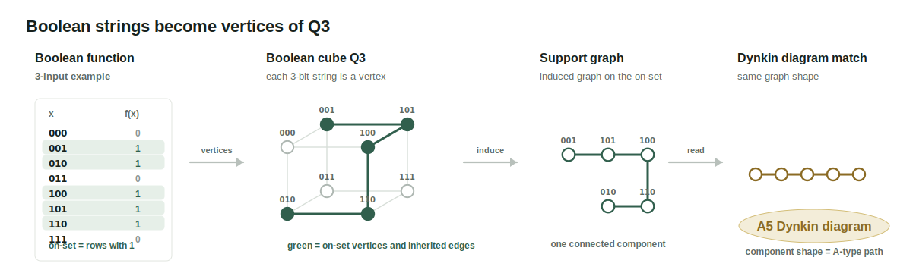
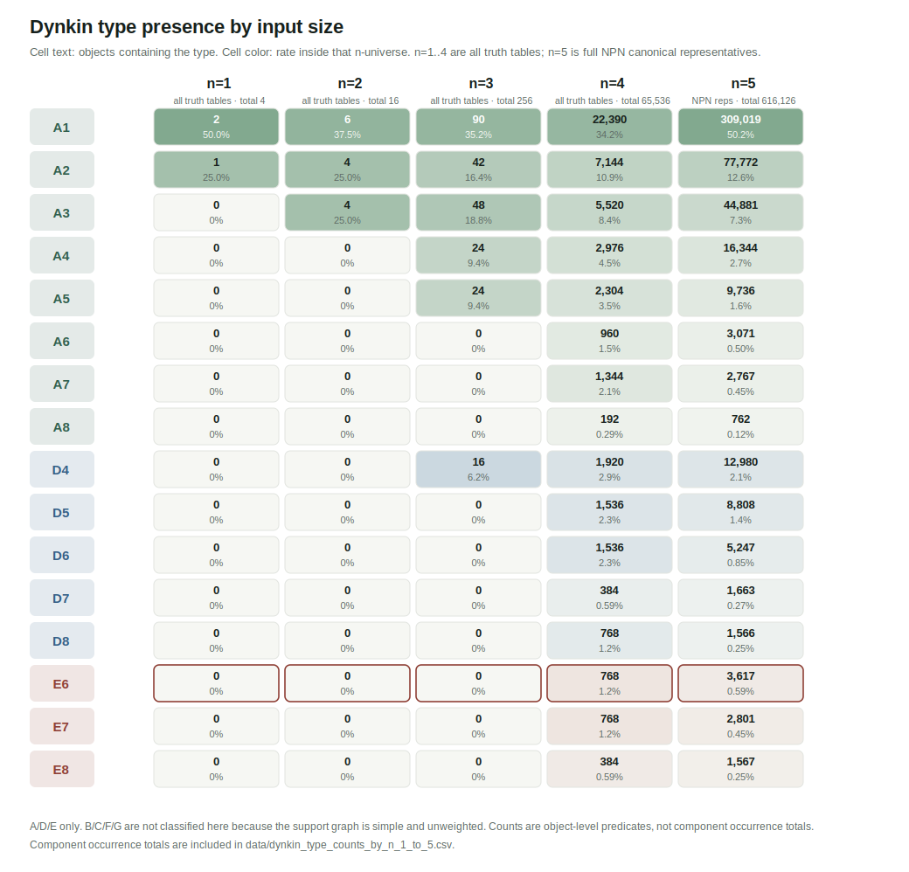
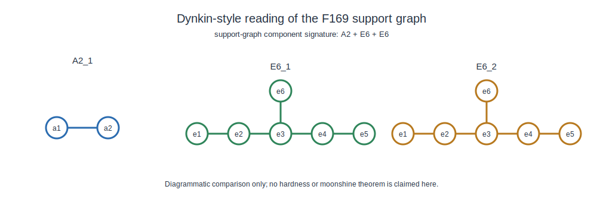
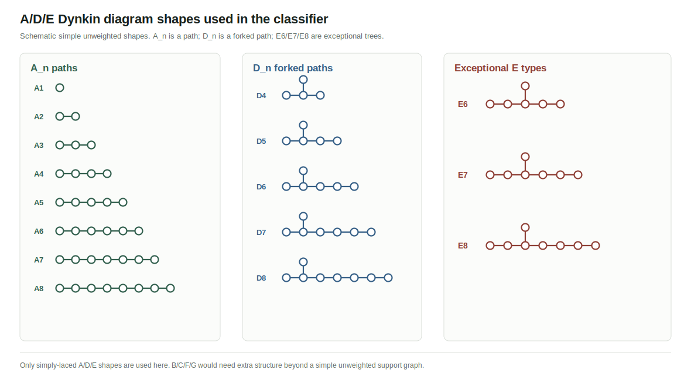

# Boolean support graphs classified by A/D/E Dynkin shapes

This repository studies Boolean functions as graphs.

Take the input bit strings of a Boolean function, place them on the Boolean
cube, keep the vertices where the function outputs `1`, and connect neighboring
vertices. The resulting support graph can contain connected pieces shaped like
simple `A/D/E` Dynkin diagrams.

Graphical summary:
[`kitaken1.github.io/boolean-dynkin-support-graphs`](https://kitaken1.github.io/boolean-dynkin-support-graphs/)

This repository has two main outputs:

1. Survey: count which A/D/E-shaped graph components appear in small Boolean
   functions, from 1-input through 5-input functions.
2. F169 case study: F169 / `0x169AE443` is a known cost-heavy 5-input
   exact-synthesis benchmark in EDA [Reference 1]. This repository reports that,
   in this support-graph classification, F169's on-set support graph has signature
   `A2 + E6 + E6`. That exact signature appears in only `3 / 616,126` classes
   in the 5-input scan, about `0.00049%`.

## Background: Boolean to Dynkin



For an `n`-input Boolean function, `n` is the number of input bits. Each bit
string is a vertex of the Boolean cube `Q_n`. The rows with `f(x)=1` form the
on-set. Keeping the cube edges between on-set vertices gives an induced support
graph.

The connected components of that graph can then be compared with simple
unweighted `A/D/E` Dynkin diagram shapes. In this repository, `Dynkin` means a
graph-shape label, not a claim of Lie-theoretic structure.

See the appendix for the A/D/E graph shapes used by the classifier.

## Contribution 1: A/D/E Support-Graph Survey



The scan counts which `A/D/E`-shaped components occur for `n=1..5`.

| n | universe | no Dynkin | has Dynkin | has E | has E6 |
|---:|---|---:|---:|---:|---:|
| 1 | all truth tables | 1 | 3 | 0 | 0 |
| 2 | all truth tables | 2 | 14 | 0 | 0 |
| 3 | all truth tables | 68 | 188 | 0 | 0 |
| 4 | all truth tables | 32,114 | 33,422 | 1,920 | 768 |
| 5 | full NPN canonical representatives | 242,634 | 373,492 | 7,941 | 3,617 |

## Contribution 2: Case Study, F169



Observation: F169 is a known EDA benchmark that falls into a rare
support-graph bucket.

F169's on-set support graph has exact signature `A2 + E6 + E6`.

The point of this case study is the overlap: an EDA-important benchmark also
lands in an unusual A/D/E support-graph shape. That coincidence may be worth
investigating further, while not being treated as an explanation of synthesis
cost.

The vertex and edge derivation is listed in the appendix.


| view | statement |
|---|---|
| EDA view | F169 is a cost-heavy 5-input benchmark. (known) [Reference 1] |
| Support-graph view | F169's exact `A2 + E6 + E6` support signature appears in `3 / 616,126` classes, or about `0.00049%`. (new observation) |

The n=5 scan contains `616,126` NPN-canonical representatives. The F169
case-study funnel is:

| filter | count | rate |
|---|---:|---:|
| Has Dynkin | 373,492 / 616,126 | 60.62% |
| Has E | 7,941 / 616,126 | 1.29% |
| Has multi-E | 138 / 616,126 | 0.022% |
| Has E6 + E6 | 79 / 616,126 | 0.0128% |
| Has E6 + E6 and at least one A2 | 6 / 616,126 | 0.00097% |
| Exact A2 + E6 + E6 signature | 3 / 616,126 | 0.00049% |

The exact full support signature `A2 + E6 + E6` has three representatives in
the current scan: `3 / 616,126`, about `0.00049%`.

- `0x013D3EC2`
- `0x035ABC83`
- `0x169AE443` (F169)

## Data Files

The `data/` directory keeps compact tables only.

| file | role |
|---|---|
| `dynkin_presence_by_n_1_to_5.csv` | no-Dynkin / has-Dynkin and A/D/E presence counts for `n=1..5`. |
| `dynkin_type_counts_by_n_1_to_5.csv` | object counts and component occurrences for each A/D/E type. |
| `npn5_e_component_multiset_breakdown.csv` | n=5 E-component multiset counts, preserving multiplicity such as `E6 + E6`. |
| `npn5_e_type_family_breakdown.csv` | n=5 E6/E7/E8 presence-family counts. |
| `f169_observation_card.json` | compact checked facts for F169 / `0x169AE443`. |
| `f169_support_graph_vertices.csv` | F169 on-set support-graph vertices. |
| `f169_support_graph_edges.csv` | F169 on-set support-graph edges. |

## Program Code

The main scripts live in `exp/`.

| script | role |
|---|---|
| `exp/plot_dynkin_type_distribution_1_to_5.py` | draws the n=1..5 Dynkin type presence matrix. |
| `exp/plot_dynkin_diagram_shapes.py` | draws the A/D/E Dynkin shape legend. |
| `exp/plot_boolean_to_dynkin_pipeline.py` | draws the Q3 explanatory figure at the top of the page. |
| `exp/check_f169_case_study.py` | checks the compact F169 case-study data used in Contribution 2. |
| `exp/validate_package.py` | smoke-tests CSV/JSON parsing, SVG files, and local links. |

The repository keeps compact data tables and the small scripts needed to
regenerate the visible figures.

## Reproduce

Run commands from this repository root.

### Background Figure

Reads no data files.

```bash
python3 exp/plot_boolean_to_dynkin_pipeline.py
```

Expected:

- `figures/boolean_to_support_dynkin_pipeline.svg`

### Contribution 1: Survey

Reads:

- `data/dynkin_type_counts_by_n_1_to_5.csv`

```bash
python3 exp/plot_dynkin_type_distribution_1_to_5.py
python3 exp/plot_dynkin_diagram_shapes.py
```

Expected:

- `figures/dynkin_type_presence_matrix_1_to_5.svg`
- `figures/dynkin_diagram_shapes_ADE.svg`
- The matrix includes the 5-input `E6` count `3,617`.

### Contribution 2: F169 Case Study

Reads:

- `data/f169_observation_card.json`
- `data/f169_support_graph_vertices.csv`
- `data/f169_support_graph_edges.csv`
- `data/npn5_e_component_multiset_breakdown.csv`
- `data/npn5_e_type_family_breakdown.csv`

```bash
python3 exp/check_f169_case_study.py
```

Expected:

- `F169 case-study check OK`
- `truth_table=0x169AE443`
- `signature=A2 + E6 + E6`
- `vertices=14 edges=11`
- `A2+E6+E6 representatives=3`
- `E6+E6 multiset classes=79`
- `E6-present classes=3617`

### Smoke Test

Reads all compact `data/*.csv` / `data/*.json`, checks that SVGs exist, and
checks README / HTML local links.

```bash
python3 exp/validate_package.py
```

Expected:

- `package validation OK`

## AI Usage Disclosure

Some code, calculations, and drafting were assisted by Codex 5.5 xhigh and
ChatGPT 5.5 Pro.

## References

[Reference 1] Standard Performance Evaluation Corporation (SPEC), “729.abc_r:
SPEC CPU 2026 Benchmark Description.” The ABC `twoexact` input description
uses `twoexact -I 5 -N 12 169AE443` as the example for the 5-input truth table
`0x169AE443` requiring 12 two-input gates, with other classes implementable
with fewer gates.
<https://www.spec.org/cpu2026/docs/benchmarks/729.abc_r/729.abc_r.html>

## Appendix 1: Dynkin Diagram Shapes



These are the simple unweighted tree shapes used as `A/D/E` labels in the
support-graph classifier.

## Appendix 2: Why Dynkin For Boolean?

There is a suggestive symmetry question behind this support-graph construction.

Boolean functions have natural cube symmetries: input variables can be permuted,
input bits can be negated, and, in the usual NPN setting, the output can also be
negated. These operations move a truth table around while preserving much of
its Boolean-combinatorial structure.

Dynkin diagrams come from a different world: root systems, reflections, and Lie
theory. This repository does not claim that Boolean functions secretly carry
Lie-theoretic structure. The use of `A/D/E` here is deliberately weaker: after
turning an on-set into an induced subgraph of the Boolean cube, some connected
components are simple unweighted trees with the same shapes as simply-laced
Dynkin diagrams.

That makes this classification natural in a modest sense:

- the Boolean cube gives a canonical graph from the truth table,
- the support graph preserves local Hamming-neighbor structure,
- `A/D/E` diagrams provide a compact vocabulary for certain simple tree shapes,
- rare exact shape buckets can be checked reproducibly across Boolean classes.

The open question is whether this shape vocabulary is only descriptive, or
whether it points to useful invariants for logic synthesis. A stronger bridge
would need more data, such as paired on/off signatures under output negation,
cube-automorphism stabilizers, component automorphism groups, spectra,
sensitivity, algebraic degree, and exact-synthesis costs measured in a fixed
basis.

So the current claim is intentionally small: Dynkin-like diagrams are a
structured way to read support-graph shapes. They are not, by themselves, an
explanation of F169's cost behavior.

## Appendix 3: F169 Support-Graph Derivation

F169 is read here as the 5-input truth table `0x169AE443`, using the LSB-first
bit convention recorded in `data/f169_observation_card.json`.

The on-set has 14 vertices in `Q5`:

`0, 1, 6, 10, 13, 14, 15, 17, 19, 20, 23, 25, 26, 28`

Keeping only the `Q5` edges between those vertices gives 11 edges and three
connected components. The component table below lists each cube vertex both as
an integer and as a 5-bit string.

| component | shape label | vertices | inherited `Q5` edges |
|---|---|---|---|
| `A2_1` | `A2` | `20` (`10100`), `28` (`11100`) | `20-28` |
| `E6_1` | `E6` | `0` (`00000`), `1` (`00001`), `17` (`10001`), `19` (`10011`), `23` (`10111`), `25` (`11001`) | `0-1`, `1-17`, `17-19`, `17-25`, `19-23` |
| `E6_2` | `E6` | `6` (`00110`), `10` (`01010`), `13` (`01101`), `14` (`01110`), `15` (`01111`), `26` (`11010`) | `6-14`, `10-14`, `10-26`, `13-15`, `14-15` |

Thus the connected component multiset is `A2 + E6 + E6`.
